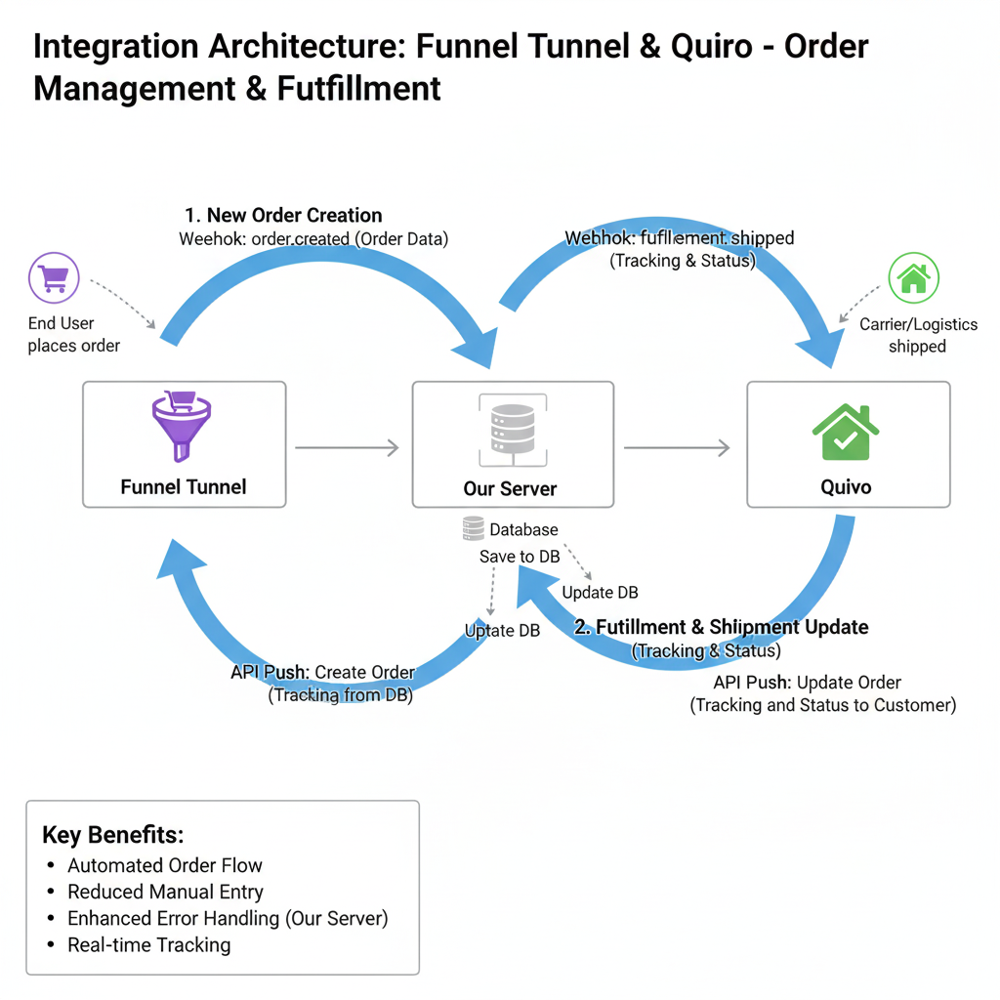

# Funnel Tunnel ↔ Quivo Integration

This repository contains the **PHP integration code** for connecting **Funnel Tunnel (e-commerce platform)** with **Quivo (order fulfillment system)** using a custom middleware server.  
The goal: automate order flow, fulfillment, and shipment updates.

---

## 📌 Overview
- **Funnel Tunnel → Our Server → Quivo** (order creation flow).
- **Quivo → Our Server → Funnel Tunnel** (shipment & fulfillment updates).
- **Middleware Server** handles:
  - Receiving & validating webhooks.
  - Transforming data formats.
  - Storing orders/shipments in a database.
  - Retrying failed API calls.
  - Logging & monitoring.

**Key Benefits:**
- Automated order processing.
- Reduced manual data entry.
- Faster fulfillment & real-time tracking.
- Centralized error handling and monitoring.

---

## 📊 Architecture Diagram

**Components:**
- **Funnel Tunnel**: order source.
- **Our Server** (PHP + DB): middleware, APIs, storage.
- **Quivo**: fulfillment & shipment system.

**Tech Stack:**
- PHP (backend)
- REST APIs + Webhooks (JSON)
- Database: PostgreSQL/MySQL (configurable)

---

## 🔄 Integration Flows

### 1. Order Creation (Funnel Tunnel → Quivo)
1. Funnel Tunnel sends `order.created` webhook → Our Server.
2. Our Server stores data → pushes to Quivo API.
3. Quivo creates order → response saved in Our Server DB.

### 2. Order Fulfillment (Quivo → Funnel Tunnel)
1. Quivo sends `fulfillment.shipped` webhook → Our Server.
2. Our Server stores shipment details → updates Funnel Tunnel via API.
3. Customers get real-time tracking updates.

---

## 🛠 API Endpoints

### Webhooks
- **Funnel Tunnel → Our Server**  
  `POST https://yourserver.com/webhooks/funnel-tunnel/order-created`

- **Quivo → Our Server**  
  `POST https://yourserver.com/webhooks/quivo/fulfillment-shipped`

### Outbound APIs
- **Our Server → Quivo**  
  `POST [Quivo API]/orders`

- **Our Server → Funnel Tunnel**  
  `PUT [Funnel Tunnel API]/orders/{order_id}`

---

## 🚨 Error Handling & Monitoring
- **Retries** for failed API/webhook calls.
- **Logging** of all payloads and responses.
- **Alerts** for persistent failures.
- **Webhook verification** (shared secret).
- **Database persistence** for recovery and auditing.

---

## 🔐 Security
- All comms over **HTTPS**.
- API keys stored as **environment variables**.
- Webhook signature validation.
- DB encryption for sensitive data.

---

## 🚀 Setup & Configuration

### Prerequisites
- Funnel Tunnel admin access + API key.
- Quivo account + API key.
- Middleware server with DB (PostgreSQL/MySQL).

### Steps
1. Configure Funnel Tunnel webhook → Our Server.
2. Configure Quivo webhook → Our Server.
3. Add API keys & secrets in `.env` file.
4. Deploy server (Apache/Nginx + PHP).
5. Test with a sample order.

---

## 🔮 Future Enhancements
- Inventory sync (Quivo → Funnel Tunnel).  
- Refund/cancellation sync.  
- Product catalog sync.  
- Advanced reporting from DB.  

---

## 👨‍💻 Author & Support
**Muhammad Husnain**  
For support/questions: contact the repository owner.
